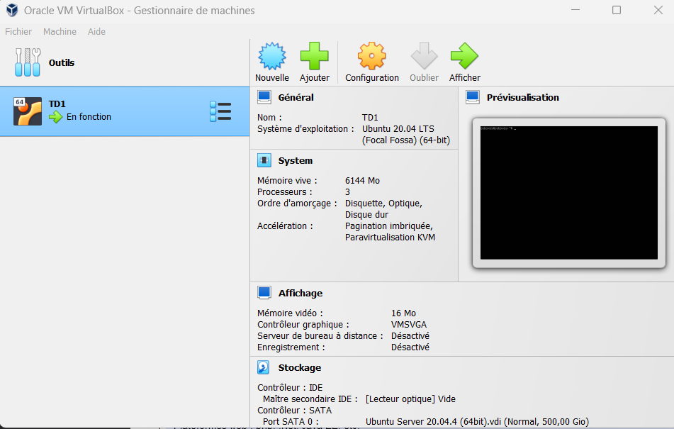

- Installation et Configuration de Virtual Box
- Installation de la VM Ubuntu 20.04
- 
- Installation de SSH server sur le VM
- Installation de Putty sur la machine physique
- Installation de Vagrant sur la machine physique
- Installation de LogSeq sur la machine physique