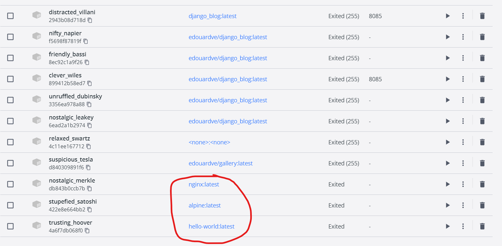
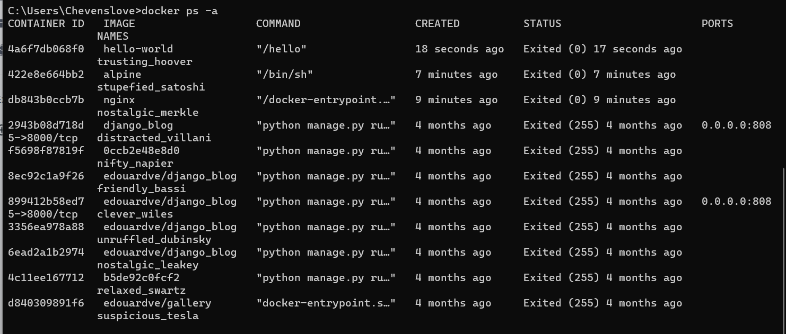
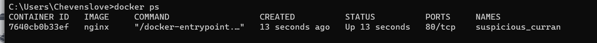

- Installation de Docker
- Github pour docker nginx : https://github.com/nginxinc/docker-nginx/blob/master/stable/alpine-slim/Dockerfile
- Pull les images hello-world, nginx
- 
-
- 
-
- Exemple d'un fichier docker que j'ai cree
- [Dockerfile](../assets/Dockerfile_1680081055938_0)
- Lancer un docker file
- 
- Lister les images docker en cours d'execution
- 
-