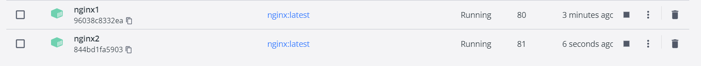

- Installation de Docker
- Github pour docker nginx : https://github.com/nginxinc/docker-nginx/blob/master/stable/alpine-slim/Dockerfile
- Pull les images hello-world, nginx
- 
-
- 
-
- Exemple d'un fichier docker que j'ai cree
- [Dockerfile](../assets/Dockerfile_1680081055938_0)
- Lancer un docker file
- 
- Lister les images docker en cours d'execution
- 
- Lancer deux images nginx de version differentes sur des ports differents
  ```bash
  docker run -p 80:80 --name nginx1 nginx:latest
  docker run -p 81:80 --name nginx2 nginx:other_version
  ```
  
-
- Presentation de Malou
- Partie Plan
	- JIRA
	- Sprint
	- Slack
	- Google Meet
	- Notion
- Partie Code
	- Pour bien nommer ses commits
	- Utilisation de Gitmoji
	- Conventionnal commit
		- Scementic release, un outil permettant de gerer automatiquement le numero de version en fonction des mots cles utilises.
	- Il y a deux flows standards a savoir
	  GitFLow et Trunk Flow
	- Test son code:
		- pytest, un outil python permettant de tester des codes
		- Test unitaire
		- docker
- Partie Build
	- docker => Amazon ECR => Argo => Kubernetes
	- Amazon ECR  est comme Docker Hub
	- Argo est
	- Kubernetes aide dans l'allocation des ressources, des duplication de containers automatiques
	- Utilisation des services
	- GitLab
	- Dockerfile => Docker Image => Docker Container
	- lint => Convention de code, les nommages de variable...
- Partie Test
	- Environnement ephemere
		-
	- Environnement preproduction
- Partie Release
	- Declarer des services sans clikodrome
	- AgroCD
	- Terraform
	- AWS
- Partie Deploy
	- Route versioning investigation
- Partie Operate
	- Hotfix
	- Reproduire => Tester (Unitaire et Integration) => Deployer
- Partie Monitor
	- Amazon CloudWatch
	- DataDog