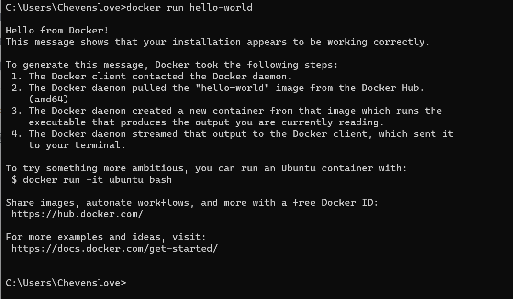

- Installation de Docker
- Github pour docker nginx : https://github.com/nginxinc/docker-nginx/blob/master/stable/alpine-slim/Dockerfile
- Pull les images hello-world, nginx
- 
-
- 
-
- Exemple d'un fichier docker que j'ai cree
- [Dockerfile](../assets/Dockerfile_1680081055938_0)
- Lancer un docker file
- 
- Lister les images docker en cours d'execution
- 
- Lancer deux images nginx de version differentes sur des ports differents
  ```bash
  docker run -p 80:80 --name nginx1 nginx:latest
  docker run -p 81:80 --name nginx2 nginx:other_version
  ```
  
-
-