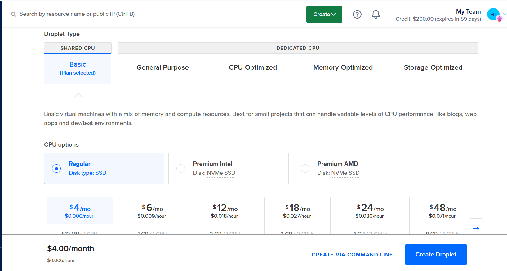

- {{video https://www.youtube.com/watch?v=qP8kir2GUgo}}
- J'ai trouve cette erreur quand j'ai fait
  ```bash
  make test
  ```
- 
- Comme solution, j'ai lance la commande avec WSL mais avant il faut installer make, git, python3 et python3-venv
  sudo apt-get update
  sudo apt-get install git python3
  sudo apt-get install python3-venv
  sudo apt-get install make
  Ensuite j'ai lance la commande make test et make run
- Creer notre fichier pipeline sur gitlab
  .gitlab-ci.yml
  ```bash
  run_tests:
    stage: test
    image: python:3.9-slim-buster
    before_script:
      - apt-get update && apt-get install make
    script:
      - make test
  
  ```
- Separation des parties settings et Repositories pour la gestion des droits d'acces. (Admin et autres utilisateurs)
- On definit les variables d'environnement surtout pour les credentials
- 
-
- Docker in docker
- Execute pipeline
- Define Stages
	- Stage 1: Run tests
	- Stage2: build_image
	- Stage3: Deploy
	- run_tests => build_image => deploy
	  Plusieurs jobs s'executent en meme temps dans une meme stage, l'ordre n'est pas garanti
	  On fait des stages pour grouper des jobs qui vont s'executer en parallele
- Prepare Deployment Server
	- Run test => Build Docker Image => Push to Docker Registry
	- Create an Ubuntu server with Digital Ocean Cloud
	- 
	- 
	- 
	- 
	- 
	- Install docker on the server
		- 
			- apt install && apt install docker.io
			- run docker ps pour s'assurer que docker est bien installe
	- Deploy application
		- Add the SSH-KEY to gitlab (the private one as file)
		  
		- Configuration du stage deploy on GitLab
		  ```bash
		  deploy:
		    stage: deploy
		    before_script:
		      - chmod 400 $SSH_KEY
		    script:
		      - ssh -o StrictHostKeyChecking=no -i $SSH_KEY root@167.172.102.77 "
		          docker login -u $REGISTRY_USER -p $REGISTRY_PASS &&
		          docker ps -aq | xargs docker stop | xargs docker rm &&
		          docker run -d -p 5000:5000 $IMAGE_NAME:$IMAGE_TAG"
		  ```
		  Ajouter l'option -o StrictHostKeyChecking=no pour dire de sauter la partie checking du serveur
	- Validate Application Run
		- Finding this error
		  
		- En fait cette erreur s'est arrivee car c'est pour la premiere fois on run notre dockerfile il fallait juste enlever la ligne de commande
		  ```bash
		  docker ps -aq | xargs docker stop | xargs docker rm
		  ```
		- Car elle sert a stopper et a supprimer les precedents images docker en cours d'execution. Ce qui serait utile pour les prochaines fois.
	- Final pipeline file
	  ```bash
	  variables:
	    IMAGE_NAME: edouardve/demo-app
	    IMAGE_TAG: python-app-1.0
	  
	  stages:
	    - test
	    - build
	    - deploy
	  
	  run_tests:
	    stage: test
	    image: python:3.9-slim-buster
	    before_script:
	      - apt-get update && apt-get install make
	    script:
	      - make test
	  
	  
	  build_image:
	    stage: build
	    image: docker:20.10.16
	    services:
	      - docker:20.10.16-dind
	    variables:
	      DOCKER_TLS_CERTDIR: "/certs"
	    before_script:
	      - docker login -u $REGISTRY_USER -p $REGISTRY_PASS
	    script:
	      - docker build -t $IMAGE_NAME:$IMAGE_TAG .
	      - docker push $IMAGE_NAME:$IMAGE_TAG
	  
	  deploy:
	    stage: deploy
	    before_script:
	      - chmod 400 $SSH_KEY
	    script:
	      - ssh -o StrictHostKeyChecking=no -i $SSH_KEY root@167.172.102.77 "
	          docker login -u $REGISTRY_USER -p $REGISTRY_PASS &&
	          docker run -d -p 5000:5000 $IMAGE_NAME:$IMAGE_TAG"
	  ```
- GR2 -> WAMP et DOCKER
	- Dockeriser une application web existant avec Docker compose
	  Pour cela, ils ont mis toutes les resources necessaires:
	  Wampserver qui contient (Php, Mysql, Apache)
	  nginx
	  Copier les fichiers et les dossiers du projets existants
	  Preparer l'environnement sur lequel le projet va run
	  Mettre les commandes
- GR3 -> JIRA software / Docker compose (React et Laravel)
	- Creer un compte sur JIRA
	- Choisir le model du projet (SCRUM)
	- Effectuer une simulation d'un projet
		- Epic
			- Sprint
		- Feuille de route
	- Creer le fichier docker
		- Creer deux docker files (l'un pour le front et l'autre pour le back)
		- Bonne pratique => Utilise toujours des crochets [] dans l'instruction CMD de docker file
- GR4 -> Docker
	- Images et Conteneurs
	- Le processus de build Docker
	  Docker file -> Docker Image -> Docker container
	- Dans le docker file on precise l'image a partir de laquelle on va partir
	- Docker construit l'image couche par couche, chaque couche est une instruction dans le docker file
	- Reseaux
	- Volumes ???
	- Application MultiConteneur
		- A l'interieur du tag services, on met plusieurs containers
- GR5 -> Monitoring
	- Comprendre ce qui passe dans une app
	- Recuperer des metrics
	- Savoir sur l'evolution, les points faibles et forts, les pages le plus et les moins vues
	- Utilisation de Grafana parmi tous les outils existants
		- Permettre de donner des graphiques
		- un outil de dashboard
		- Afficher des metrics et statistiques des applications
		- Alertings automatiques
	- Utilisation de Prometheus
		- Collection de metriques numeriques sous formes de series temporelles
		- Outil de monitoring et d'alerte
		- Collection de donnees multidimensionnelle
		- Exportation des metrics des Apps
- GR6 -> Unit Tests
	- Code-Driven-Testing
	- Remainiement de Code
	- Utilisation d'un framework JavaScript => Jest